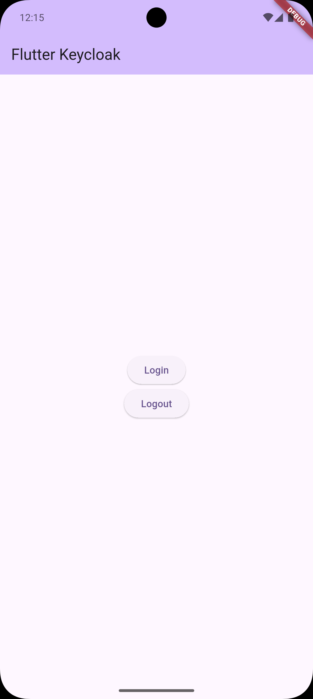
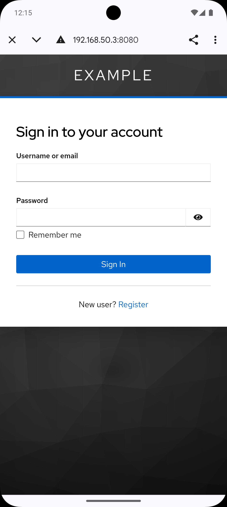
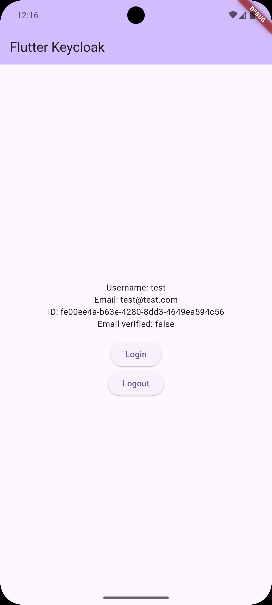

# Flutter App with Keycloak Authentication

This project demonstrates the integration of a Flutter application with Keycloak for authentication and identity management.

## 🚀 Features

- OAuth2/OpenID Connect authentication with Keycloak
- Login with PKCE (Proof Key for Code Exchange)
- JWT token management
- User information display
- Logout with token revocation

## 📋 Prerequisites

- Flutter SDK
- Docker and Docker Compose
- Git

## 🔧 Setup

### 1. Keycloak Configuration

Keycloak is configured via Docker Compose. Before starting, adjust the IP in the `docker-compose.yml` file:

```yaml
KC_HOSTNAME: 192.168.50.3  # Change to your machine's IP
```

To start Keycloak:

```bash
docker-compose up -d
```

After starting, access the admin console:
- URL: http://YOUR_IP:8080
- Username: admin
- Password: admin

> **Note**: The `mobile` client is already configured through the `realm-export.json` file, which is automatically imported during Keycloak initialization.

### 2. Flutter App Configuration

In the `lib/auth_service.dart` file, verify that the IP is correct:

```dart
final String keycloakUrl = 'http://192.168.50.3:8080';  # Change to the same IP configured in docker-compose
final String realm = 'master';  # Using the master realm
```

## 🏃‍♂️ Running the Project

1. Clone the repository and checkout the correct branch:
```bash
git clone [REPOSITORY_URL]
git checkout [BRANCH_NAME]
```

2. Install dependencies:
```bash
flutter pub get
```

3. Run the application:
```bash
flutter run
```

## 🔐 Security

- The app uses PKCE for secure authentication
- Tokens are securely stored using `flutter_secure_storage`
- Communication with Keycloak is done via HTTPS (recommended for production)

## 📝 Important Notes

- Keycloak database is configured as `dev-mem` (in-memory)
- Data will be lost when restarting the Keycloak container
- For production, consider using a persistent database (PostgreSQL)
- The configured IP must be accessible by both the app and browser
- This project uses Keycloak's `master` realm
- The `mobile` client is automatically imported from the `realm-export.json` file

## 🤝 Contributing

Feel free to open issues or submit pull requests with improvements.

## 📄 License

This project is licensed under the MIT License.

## Screenshots

<p align="center">
  
  
  
</p>